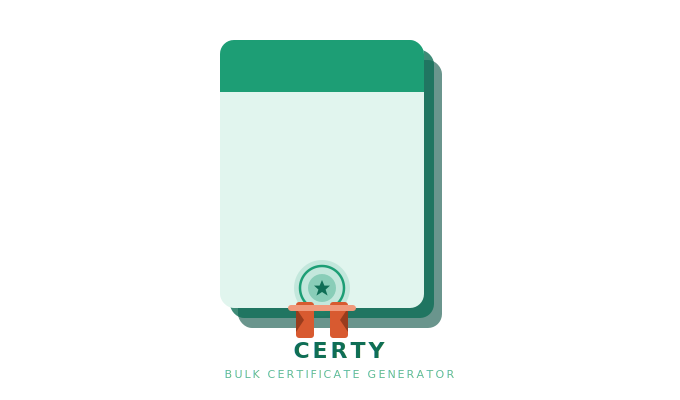

<div align="center">

# Certy


**Certy** is a desktop app for bulk certificate generation from a PNG template and a spreadsheet.

[](https://github.com/shahil-sk/certflow/actions)
[](https://github.com/shahil-sk/certflow/releases/latest)
[](https://github.com/shahil-sk/certflow/releases)
[](LICENSE)
[](https://python.org)
[](https://github.com/shahil-sk/certflow/releases)
[](https://ko-fi.com/shahilsk)

<br>

[Download](https://github.com/shahil-sk/certflow/releases/latest) &bull;
[Development](#development) &bull;
[Contributors](#contributors)

</div>

## About

**Certy** turns a PNG template and a spreadsheet into a full batch of certificates with no code required.

Load your design, drag fields into position, map your data, and generate a PDF for every row in your spreadsheet. Supports custom fonts, RGB and CMYK color modes, live preview, and reusable `.certy` project files.

## Features

- **Drag-and-drop field placement** — click and drag each field directly onto the canvas. No coordinate guessing.
- **Live preview** — render one real certificate before committing to the full batch.
- **Batch PDF output** — one PDF per data row, automatically named from your spreadsheet fields.
- **Custom fonts** — drop any `.ttf` or `.otf` into `fonts/` and it appears in the selector immediately.
- **RGB and CMYK** — switch color modes for screen or print output.
- **Project files** — save your session as a `.certy` file and reload it later.
- **Non-blocking UI** — generation runs in a background thread with a live progress bar.

## Installation

Download the latest release for your platform:

### [Windows](https://github.com/shahil-sk/certflow/releases/latest) | [Linux](https://github.com/shahil-sk/certflow/releases/latest) | [macOS](https://github.com/shahil-sk/certflow/releases/latest)

## Development

```bash
git clone https://github.com/shahil-sk/certflow.git
cd certflow
python3 -m venv venv
source venv/bin/activate
pip install -r requirements.txt
python3 main.py
```

To add custom fonts, drop `.ttf` or `.otf` files into the `fonts/` folder.

## How to use it

1. **Load template** — select a PNG certificate background.
2. **Load Excel** — select an `.xlsx` file where row 1 is field headers.
3. **Place fields** — drag each field label to its position on the canvas.
4. **Style fields** — set font, size, and color per field.
5. **Preview** — render one certificate using the first data row.
6. **Generate** — pick RGB or CMYK, choose an output folder, and watch the progress bar.
7. **Save project** — write a `.certy` file for next time.

## Tech stack

| Library | Purpose |
|---|---|
| [Pillow](https://python-pillow.org/) | Image rendering and PNG export |
| [openpyxl](https://openpyxl.readthedocs.io/) | Reading `.xlsx` data files |
| [fpdf2](https://py-pdf.github.io/fpdf2/) | Writing output PDFs |
| Tkinter (stdlib) | Desktop GUI |

# Support the Project

If you enjoy the project and want to support future development:

<p align="left">
  <a href="https://ko-fi.com/shahilsk">
    
  </a>
</p>

## License

[MIT](LICENSE)
